# The Physics of Traffic Control
### Hiểu cách bảo vệ service khỏi bị overwhelm bởi request quá nhiều

> **Đối tượng:** Middle Backend + Frontend Engineer  
> **Thời lượng:** 100 phút — 2 presenter (P1, P2)  
> **Mức độ:** Solid software fundamentals assumed

---

## MỤC LỤC

1. [Giới thiệu — Rate Limiting là gì và tại sao cần?](#1-giới-thiệu)
2. [Implementation Layers — Chặn ở đâu?](#2-implementation-layers)
3. [Distributed State — Redis, Atomicity, Lua](#3-distributed-state)
4. [Algorithms — 5 thuật toán, mạnh yếu từng cái](#4-algorithms)
5. [System Design — Thiết kế Rate Limiter phân tán](#5-system-design)
6. [Demo — Bài toán thực tế](#6-demo)
7. [Checkpoint Questions](#7-checkpoint-questions)
8. [Case Study — Kiểm định một hệ thống thật](#8-case-study)

---

## 1. Giới thiệu

### Rate Limiting là gì?

**P1:** Rate limiting là cơ chế kiểm soát tần suất request được phép đi qua một hệ thống trong một đơn vị thời gian. Nói nôm na: "bạn chỉ được gõ cửa X lần mỗi phút — quá thì mời ra."

Trước khi đi vào kỹ thuật, hãy xem tại sao nó tồn tại:

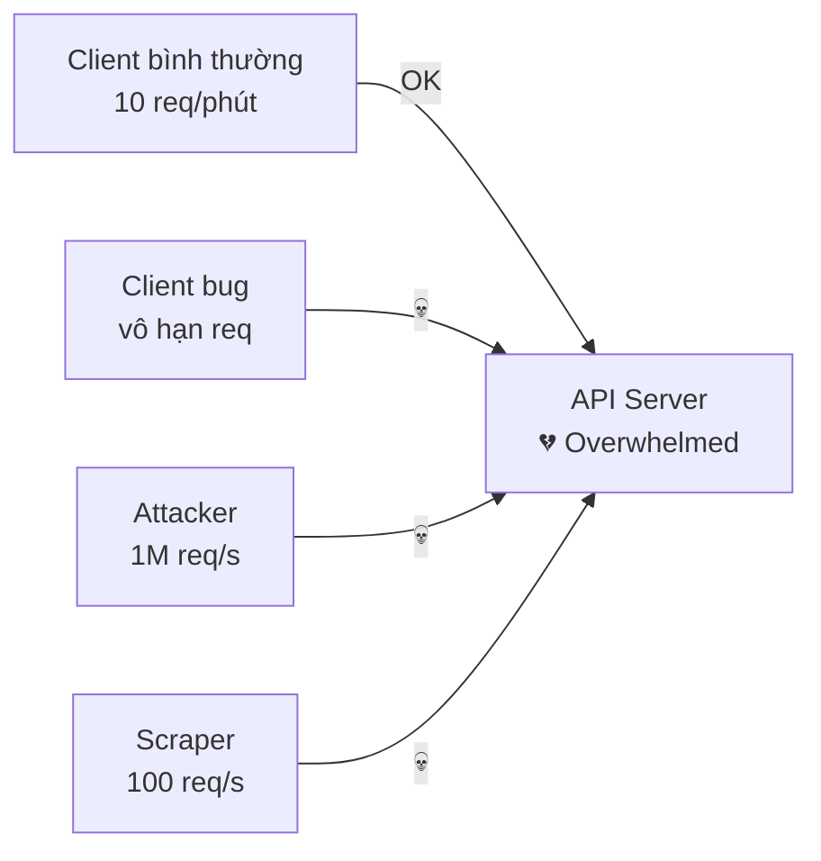

**Không có rate limit:** một client duy nhất có thể làm toàn bộ hệ thống tê liệt — dù vô tình (bug) hay cố ý (attack).

---

### Phân biệt 3 khái niệm hay nhầm

Hỏi một câu: **request vượt ngưỡng bị làm gì?**

| | Rate Limiting | Throttling | Load Shedding |
|---|---|---|---|
| **Request vượt ngưỡng** | Reject ngay · `429` | Delay · queue hoặc sleep | Drop · `503` |
| **Quyết định dựa trên** | Counter theo key: user, API key, IP | Tốc độ downstream chịu được | Sức khỏe server: in-flight, CPU, p99 |
| **Bảo vệ ai** | Các client khác (công bằng) | Downstream: DB, SMS gateway | Chính service |
| **Thuật toán** | Token bucket, sliding window | Leaky bucket, blocking acquire | Concurrency limit, AIMD, priority |
| **Client nên làm gì** | Chờ `Retry-After` rồi retry | Không cần làm gì, chỉ chờ | Retry với backoff + jitter |
| **Gặp ở đâu** | API gateway, Kong, Stripe API | Kafka consumer, worker | Envoy, load balancer, gRPC server |

- Rate limit chặn cả khi server đang rảnh (chỉ nhìn counter của 1 client). Load shedding chỉ chặn khi server gần quá tải, bất kể ai gửi. Cần cả hai.
- Circuit breaker khác load shedding: circuit breaker là **bên gọi** ngừng gọi downstream đang lỗi; load shedding là **server** từ chối việc nó không làm kịp.

> **Lưu ý thực tế:** AWS, Stripe, GitHub đều gọi là "rate limiting" dù thực ra là reject (429). Từ "throttling" bị dùng sai rộng rãi. Trong HTTP context: throttling = rate limiting = 429.

**Throttling thật** chỉ xuất hiện ở async system:

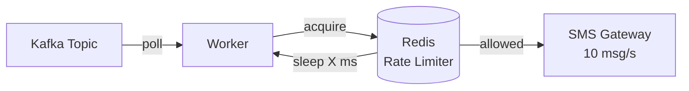

Worker tự kìm tốc độ trước khi đẩy sang downstream — không có client nào chờ HTTP response ở đây.

---

### HTTP Status Codes

```
429 Too Many Requests   ← rate limit (user gửi quá nhiều)
503 Service Unavailable ← load shedding (system đang quá tải)
403 Forbidden           ← authorization (không phải rate limit!)

Kèm headers:
Retry-After: 30              ← chờ bao lâu (giây)
X-RateLimit-Limit: 100       ← limit là bao nhiêu
X-RateLimit-Remaining: 0     ← còn bao nhiêu
X-RateLimit-Reset: 1704067320 ← epoch khi nào reset
```

---

## 2. Implementation Layers

**P2:** Rate limiting không chỉ sống ở một chỗ. Nó có thể — và nên — được áp dụng ở nhiều tầng cùng lúc, mỗi tầng chặn một loại threat khác nhau.

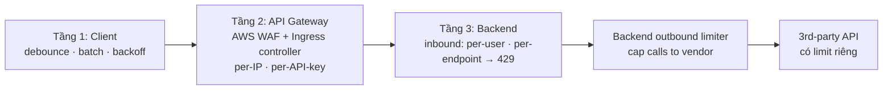

- **Client:** gửi ít request hơn.
- **API Gateway:** limit theo IP / API key trước khi vào backend. Nhiều hệ thống bỏ qua tầng này.
- **Backend inbound:** limit request đi vào backend (theo user, endpoint) → `429`.
- **Backend outbound:** limit request backend gọi ra 3rd-party API. Vendor được bảo vệ, mình giữ được quota. Chỉ backend biết mình đang gọi vendor nào, gateway chỉ thấy traffic đi vào.

---

### 2.1 Client-side — Ngăn request lãng phí

Không bảo vệ server — mục tiêu là **đừng gửi request thừa ngay từ đầu**.

#### Debounce

```typescript
// Người dùng gõ search → không gọi API mỗi keystroke
const search = debounce((query) => {
    api.search(query)
}, 300)

// Gõ "r","a","t","e" trong 200ms → chỉ gọi 1 lần với "rate"
```

#### Batching / Flush

```typescript
// Thay vì gửi từng analytics event:
track("click", { button: "buy" })   // → 1 request
track("scroll", { depth: 50 })      // → 1 request
track("view", { page: "home" })     // → 1 request

// Batch lại, flush mỗi 5 giây:
const queue = []
setInterval(() => {
    if (queue.length > 0) {
        api.batchTrack(queue)        // → 1 request thay vì N
        queue.length = 0
    }
}, 5000)

// 10 events trong 10 giây → 2 request
```

#### Exponential Backoff với Full Jitter

```typescript
// Khi nhận 429 từ server
async function callWithRetry(fn, maxRetries = 5) {
    for (let i = 0; i < maxRetries; i++) {
        try {
            return await fn()
        } catch (err) {
            if (err.status !== 429) throw err

            // Retry-After từ server là mức chờ tối thiểu
            const retryAfterMs = Number(err.headers["retry-after"] ?? 0) * 1000
            // Full jitter: tránh thundering herd
            const cap  = 30_000
            const base = 500
            const jitter = Math.random() * Math.min(cap, base * 2 ** i)
            await sleep(retryAfterMs + jitter)
        }
    }
}
```

**Jitter** = phần ngẫu nhiên trong thời gian chờ.

| Kiểu | Thời gian chờ (t = base·2ⁿ, có cap) |
|---|---|
| Không jitter | `t` |
| Equal jitter — random một nửa | `t/2 + random(0, t/2)` |
| Full jitter — random toàn bộ | `random(0, t)` |

> **Tại sao cần jitter?** 1000 client cùng nhận 429 → cùng retry sau đúng 1s → lại spike. Jitter phân tán retry theo thời gian. Header chuẩn là `Retry-After` (RFC 9110), không phải `X-Retry-After`. Tuân theo `Retry-After` nguyên văn vẫn gây spike, nên cộng thêm jitter.

---

### 2.2 Infrastructure — tầng API Gateway trên AWS EKS

**P1:** Tầng này chặn request **trước khi chạm vào application code**. Trên EKS, "API gateway" không phải một sản phẩm duy nhất: request đi qua nhiều chặng, và 3 chặng có thể reject.

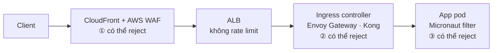

| Chặng | Limit theo | Counter nằm ở | Vượt limit | Dùng cho |
|---|---|---|---|---|
| ① AWS WAF | IP, header, path | AWS, dùng chung ở edge | `403` mặc định, set thành `429` | Flood, bot: 2,000 req / 5 phút mỗi IP |
| ALB | — | — | — | Chỉ routing và TLS |
| ② Ingress controller | IP, route, header, API key | Mỗi pod controller, hoặc Redis | `429` | `/login`: 5 req/s mỗi IP |
| ③ App | User, tier, endpoint | Redis | `429` + `Retry-After` | Free 100 / phút, Pro 1,000 / phút |

- Ingress controller là chặng đầu tiên mình tự vận hành: một Deployment trong cluster, đứng trước mọi Service.
- Dùng **AWS API Gateway** thay ALB? Nó có sẵn token bucket theo route và theo API key (usage plans), trả `429`. Quota mặc định của account: 10,000 req/s, burst 5,000 mỗi region. Usage plans chỉ có ở REST API, không có ở HTTP API.

#### Chặng ① — AWS WAF rate-based rule

Chặn mọi IP gửi quá 2,000 request trong 5 phút:

```hcl
# aws_wafv2_web_acl, gắn vào CloudFront hoặc ALB
rule {
  name     = "per-ip-2000-per-5min"
  priority = 1
  statement {
    rate_based_statement {
      limit                 = 2000
      evaluation_window_sec = 300
      aggregate_key_type    = "IP"
    }
  }
  action {
    block {
      custom_response { response_code = 429 }
    }
  }
  # visibility_config bắt buộc, lược bỏ cho gọn
}
```

- Flood bị chặn ở edge của AWS, không mở connection tới ALB, ingress hay pod.
- Window chỉ có 1, 2, 5 hoặc 10 phút. Hợp với flood, dò mật khẩu. Quá thô cho "10 req/s".
- Key có thể là IP, IP trong `X-Forwarded-For`, header như `x-api-key`, path, hoặc kết hợp.
- Mặc định block trả `403`. Set `429` để client biết mà back off, không tưởng là lỗi auth.

> Counter là xấp xỉ, phản ứng trễ vài chục giây — không dùng WAF cho quota chính xác. Đứng sau CloudFront thì ALB chỉ thấy IP của CloudFront, nên gắn WAF ở CloudFront hoặc key theo forwarded IP. Limit tối thiểu là 10 request / window. AWS Shield Standard (miễn phí) đã lo flood L3/L4; WAF dành cho HTTP flood.

#### Chặng ② — Ingress controller dùng thuật toán gì?

Tùy counter nằm ở đâu:

| Controller · setting | Thuật toán | Counter nằm ở | Khi có burst |
|---|---|---|---|
| Envoy Gateway · `rateLimit.type: Local` | **Token bucket** | RAM của từng pod Envoy | Bucket 10 token, nạp lại mỗi giây. 10 request qua ngay, request thứ 11 nhận `429` |
| Envoy Gateway · `rateLimit.type: Global` | **Fixed window** | Redis, qua ratelimit service của Envoy | Counter reset mỗi `unit`. Có thể lọt 2× limit ở ranh giới window |
| Kong · `rate-limiting` | **Fixed window** | RAM pod, Postgres hoặc Redis (`policy`) | Cũng lọt 2× ở ranh giới. Nhiều window cùng lúc: `second`, `minute`, `hour` |
| Kong Enterprise · `rate-limiting-advanced` | **Sliding window** | Redis | Tính cả window trước, không lọt 2× |

- **Local:** không tốn network hop, nhưng mỗi pod đếm riêng. 3 replica controller → cho qua tới 3× limit.
- **Global:** mọi replica đếm chung, đổi lại mỗi request tốn 1 lần gọi Redis. Section 3.1 giải thích vì sao counter phải dùng chung.
- **Gotcha:** sau ALB phải key theo IP thật của client trong `X-Forwarded-For`. Nếu không, mọi user mang IP của ALB và dùng chung một bucket. (Envoy Gateway: `ClientTrafficPolicy` → `clientIPDetection.xForwardedFor.numTrustedHops: 1`.)

> Redis sập thì cả global limiter của Envoy lẫn Kong (`fault_tolerant: true`) mặc định vẫn cho traffic đi qua — cần quyết định có chấp nhận điều đó không. Envoy Gateway implement Kubernetes Gateway API, bản kế nhiệm của Ingress.

Infrastructure rate limit vẫn thô: ingress biết IP, route, header, nhưng không biết user đang dùng gói nào.

---

### 2.3 Application / Middleware — Business Logic

**P2:** Infrastructure rate limit thô — per IP, không biết user là ai. Application layer mới có **context business**:

```kotlin
@Filter("/**")
class RateLimitFilter(
    private val rateLimiter: TokenBucketRateLimiter
) : HttpServerFilter {

    override fun doFilter(
        request: HttpRequest<*>,
        chain: ServerFilterChain
    ): Publisher<MutableHttpResponse<*>> {

        val userId   = request.headers["X-User-Id"]
        val endpoint = request.path
        val tier     = userService.getTier(userId)  // free / pro / enterprise

        // Limit khác nhau theo tier
        val limit = when (tier) {
            "enterprise" -> 10_000
            "pro"        -> 1_000
            else         -> 100      // free
        }

        val result = rateLimiter.check(key = "$userId:$endpoint", limit = limit)

        return if (!result.allowed) {
            Mono.just(
                HttpResponse.status<Any>(HttpStatus.TOO_MANY_REQUESTS)
                    .header("Retry-After", result.retryAfterMs.toString())
                    .header("X-RateLimit-Remaining", "0")
            )
        } else {
            chain.proceed(request)
        }
    }
}
```

**Điều Infrastructure không làm được, Application làm được:**
- User VIP có limit cao hơn
- Endpoint `/export` có limit riêng (chậm, tốn resource)
- Trial account bị giới hạn hơn paid
- Limit theo API key thay vì IP

---

## 3. Distributed State

**P1:** Trước khi xem các thuật toán, cần hiểu **tại sao Redis và tại sao Lua** — vì mọi thuật toán đều xây trên nền này.

### 3.1 Vấn đề: nhiều pod, counter dùng chung

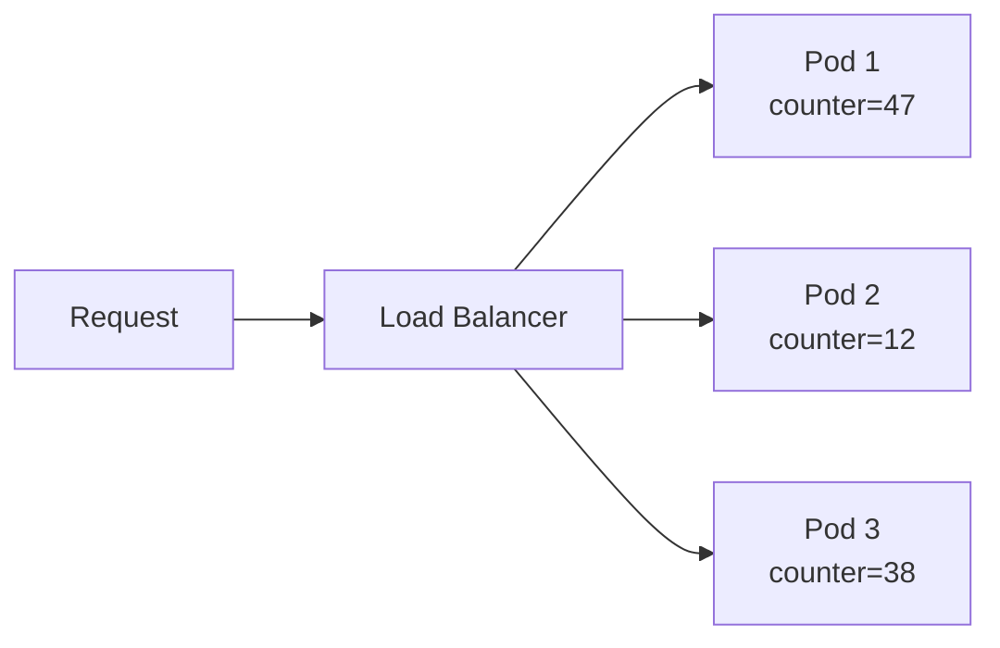

Mỗi pod có counter riêng → tổng thực là 97, nhưng mỗi pod nghĩ mình mới dùng 47/12/38 → limit bị bypass.

**Giải pháp:** Counter dùng chung trên **Redis**.

---

### 3.2 Race Condition và fix bằng Lua Script

**Race:** GET và SET là 2 round trip riêng, pod khác chen vào giữa được.

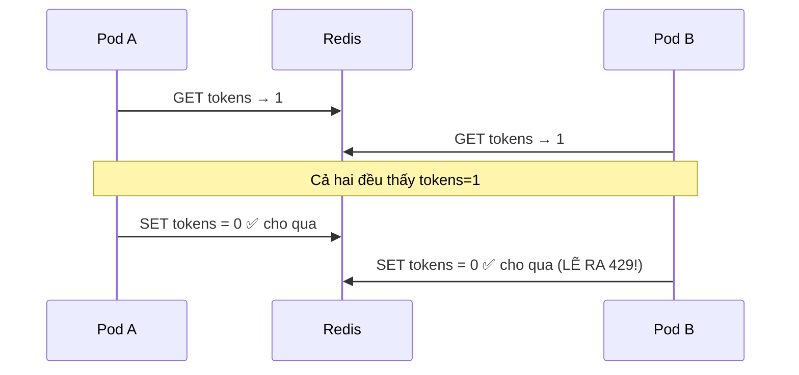

Hai pod đọc cùng lúc → cùng thấy tokens=1 → cả hai ghi đè → **lọt 1 request**.

**Fix:** Redis chạy command trên một thread. Gộp đọc + quyết định + ghi vào một Lua script → không ai chen vào giữa. Pod B phải chờ script của Pod A chạy xong, đọc `0`, trả `429`.

```lua
-- Toàn bộ block này là atomic — không ai chen được
local tokens = tonumber(redis.call('GET', KEYS[1])) or tonumber(ARGV[1])  -- capacity
if tokens >= 1 then
    redis.call('SET', KEYS[1], tokens - 1)
    return 1   -- allowed
else
    return 0   -- rejected
end
```

> Cùng vấn đề với `INCR` + `EXPIRE`: crash giữa 2 lệnh → key không có TTL → user bị chặn mãi mãi. Đưa cả hai vào script.

---

### 3.3 Redis Cluster và Hash Tag

Trong Redis Cluster, Lua script **chỉ chạy được trên 1 node**. Nếu 2 key nằm trên 2 node khác nhau → `CROSSSLOT error`.

**Giải pháp: Hash Tag `{}`**

```bash
# Không có hash tag → 2 key có thể ở 2 node khác nhau
rl:user_456:prev  → node A
rl:user_456:curr  → node B  ← CROSSSLOT!

# Có hash tag → Redis chỉ hash phần trong {}
rl:{user_456}:prev  → hash "user_456" → node B
rl:{user_456}:curr  → hash "user_456" → node B ✅
```

---

## 4. Algorithms

**P2:** Bây giờ mới đến phần thuật toán. Tất cả đều dùng Redis + Lua như đã nói ở trên.

### Bản đồ tổng quan

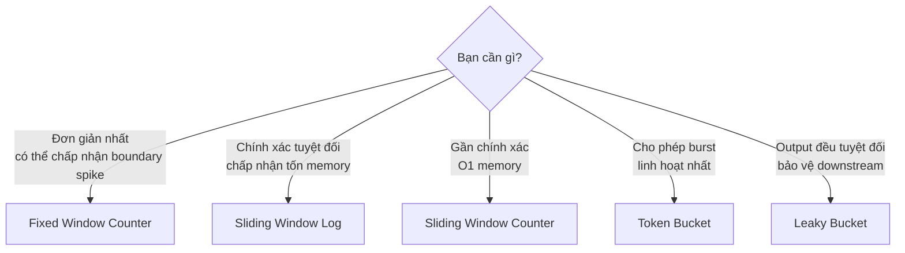

---

### 4.1 Fixed Window Counter

**Cơ chế:** Chia thời gian thành cửa sổ cố định. Mỗi cửa sổ = 1 counter.

```
window_index = floor(now_seconds / 60)
key = "rl:{user_456}:{window_index}"

INCR key   → tăng counter
EXPIRE key 60  → tự xóa sau 60s
```

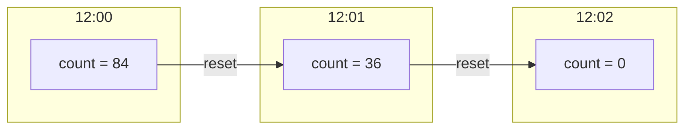

**Điểm mạnh:** Đơn giản nhất, O(1), `INCR` atomic sẵn không cần Lua  
**Điểm yếu:** Boundary spike — 99 req lúc 12:00:59 + 99 req lúc 12:01:01 = 198 req trong 2 giây nhưng đều hợp lệ

```
12:00:59 → 99 request → count_12:00 = 99 < 100 ✅
12:01:01 → 99 request → count_12:01 = 99 < 100 ✅
Thực tế: 198 request trong 2 giây 💀
```

---

### 4.2 Sliding Window Log

**Cơ chế:** Lưu timestamp của từng request được cho qua trong Redis Sorted Set. **Danh sách timestamp đó chính là LOG — lý do của cái tên.** Request bị reject không ghi vào log.

```
ZREMRANGEBYSCORE key -inf (now-10s)  → xóa entry cũ hơn window
ZCARD key                             → đếm còn lại
ZADD key now now                      → ghi timestamp mới (chỉ khi cho qua)
```

**Traffic bình thường** — limit 10 request / 10 s:

| Request | timestamp | status |
|---|---|---|
| #1 | 00:01 | Pass |
| #2 … #10 | 00:04 | Pass |
| #11 | 00:07 | **429** — đã có 10 trong window |
| #12 | 00:13 | Pass — window 00:03–00:13, #1 đã ra khỏi window, còn 9 |

**Burst tại biên 00:10** — cùng limit:

| Request | timestamp | status |
|---|---|---|
| #1 | 00:01 | Pass |
| #2 … #9 | 00:09 | Pass |
| #10 … #14 | 00:12 | #10, #11 Pass · #12, #13, #14 **429** |

```
window_start = timestamp − window_length = 12 − 10 = 00:02
đếm từ 00:02 tới 00:12: #2 … #9 = 8 → còn 2 slot → #10, #11 qua, #12–#14 bị chặn
```

Fixed window reset counter ở 00:10 nên cho cả 5 request qua. Sliding log không bám theo đồng hồ nên không có biên để lợi dụng.

#### Cái giá: bộ nhớ (slide riêng)

Mỗi request được cho qua nằm trong Redis suốt window → **bộ nhớ = traffic × window**. Mỗi entry sorted set ~100 bytes (score + member unique như timestamp + request ID + skiplist node + hash entry; set dưới 128 entry dùng listpack ~20–30 bytes).

| Window | Entry ở 100,000 req/s | Redis memory |
|---|---|---|
| 10 s | 1M | 0.1 GB |
| 1 phút | 6M | 0.6 GB |
| 1 giờ | 360M | 36 GB |
| 1 ngày | 8.64B | 864 GB |

Fixed window chỉ lưu **1 counter** mỗi key, bất kể traffic. Chỉ dùng sliding log khi cần đếm chính xác đáng giá RAM, ví dụ billing.

---

### 4.3 Sliding Window Counter

**Cơ chế:** Hybrid — chỉ lưu 2 counter, ước lượng bằng trọng số.

> **Thỏa hiệp giữa bộ nhớ và điều kiện biên:** chỉ 2 counter mỗi key như fixed window, nhưng không dồn 2× limit vào vài giây quanh ranh giới window như fixed window.

```
estimate = prev_count × weight + curr_count
weight   = 1 - (elapsed / window_size)
```

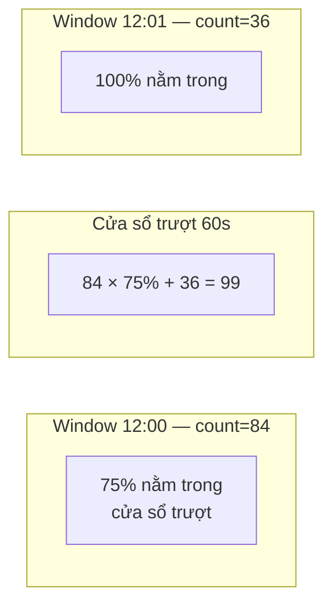

**Điểm mạnh:** O(1) memory, gần chính xác (~0–5% sai số)  
**Điểm yếu:** Giả định phân bố đều → worst case 2× limit khi burst dồn cuối window

```
12:00:59 → 99 request, 12:01:58 → 98 request
estimate = 99 × (1/60) + 98 ≈ 99.65 → cho qua ❌
Thực tế: 197 request trong 60s
```

---

### 4.4 Token Bucket

**Cơ chế:** Bucket chứa token. Token nạp liên tục theo rate. Request tiêu 1 token.

```
State: { tokens, last_ts }

Khi có request:
  elapsed    = now - last_ts
  new_tokens = min(capacity, tokens + elapsed × rate)  ← lazy refill
  if new_tokens >= 1 → cho qua, tokens--
  else               → 429
```

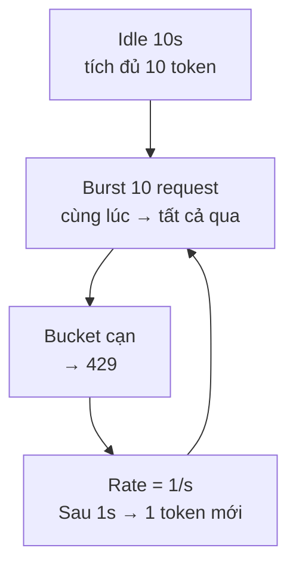

**Điểm mạnh:** Cho phép burst có kiểm soát, O(1), Retry-After chính xác, không boundary spike  
**Điểm yếu:** Cần tune 2 tham số (capacity + rate)

---

### 4.5 Leaky Bucket

**Cơ chế:** Queue với trần. Xả đều đặn ra downstream.

```
State: { queue_size, last_drain }

Khi có request:
  drained   = floor(elapsed × drain_rate)
  new_size  = max(0, queue_size - drained)  ← lazy drain
  if new_size < capacity → nhận vào, queue_size++
  else                   → 429
```

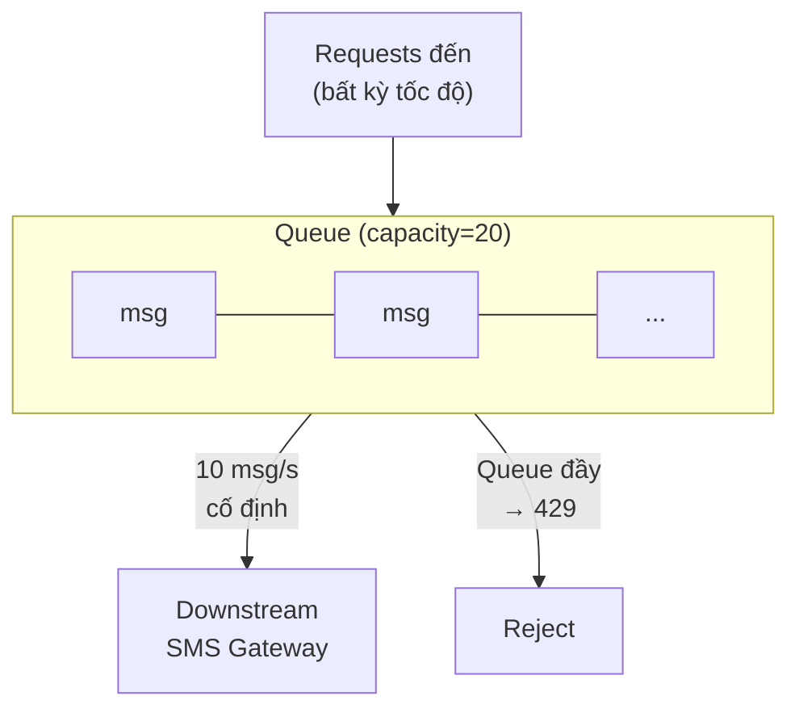

**Hình dung:** một bồn nước. Vòi trên là request đi vào, tốc độ bất kỳ, có burst. Lỗ dưới đáy là request đi ra, **tốc độ cố định**. Mực nước là số request đang chờ.

**Use case:** rate limit ở tầng Application **trước khi đẩy request xuống 3rd-party**. User gửi 50 SMS trong 1 giây, SMS gateway chỉ nhận 10 msg/s → bucket giữ burst và xả đều 10/s. Vendor không bao giờ thấy spike, nên không trả `429` cho mình.

**Bồn đầy → reject ngay, không xếp hàng ngoài bồn** (capacity 20, xả 10/s):

| Thời điểm | Chuyện gì xảy ra | Bồn |
|---|---|---|
| 0.0 s | 30 request tới, #1–#20 vào bồn | 20 / 20 |
| 0.0 s | #21–#30 bị `429` ngay lập tức | 20 / 20 |
| 1.0 s | Đã xả 10 request sang vendor | 10 / 20 |
| 1.0 s | Request mới được nhận | 11 / 20 |

- `capacity` là chỗ chờ duy nhất. Request bị reject nhận `429` + `Retry-After: 1`.
- Chọn capacity theo độ trễ chấp nhận được: `capacity = leak_rate × thời gian chờ tối đa`. Capacity 20, xả 10/s → request cuối chờ tối đa 2 s.

**Điểm mạnh:** Output rate cố định, bảo vệ downstream.  
**Điểm yếu:** Request phía sau phải chờ; burst lớn hơn capacity bị reject.

---

### So sánh tổng hợp

| Thuật toán | Memory | Boundary Spike | Burst | Retry-After chính xác | Phù hợp |
|---|---|---|---|---|---|
| Fixed Window | O(1) | ❌ 2× | ❌ | ❌ | Đơn giản, ít quan trọng |
| Sliding Log | O(N) | ✅ | ❌ | ❌ | Billing, cần chính xác tuyệt đối |
| Sliding Counter | O(1) | ⚠️ ~2× worst | ❌ | ❌ | Hầu hết API public |
| Token Bucket | O(1) | ✅ | ✅ | ✅ | **Default tốt nhất** |
| Leaky Bucket | O(1) | ✅ | ❌ | ✅ | Bảo vệ downstream |


---

## 5. System Design

**P1:** Bây giờ ghép tất cả lại để thiết kế một rate limiter phân tán hoàn chỉnh.

### 5.1 Yêu cầu hệ thống

```
- 10 triệu user
- 100,000 req/s peak
- Limit: 1000 req/phút per user
- Limit: 500,000 req/phút global per endpoint
- Latency overhead < 5ms
- Availability 99.99%
```

### 5.2 Kiến trúc tổng thể


### 5.3 Redis Cluster sharding

```
Per-user key:    rl:{user_456}:token
→ hash "user_456" → 1 slot cố định → 1 node cố định
→ Lua script chạy được, không CROSSSLOT

Global key:      rl:global:{/api/send}:shard:{random(0,15)}
→ 16 shard, mỗi shard = total_limit / 16 × 1.1 (buffer 10%)
→ Phân tán write, không hotspot
```

### 5.4 Hard Limit vs Soft Limit

| | Hard Limit | Soft Limit |
|---|---|---|
| Định nghĩa | Vượt ngưỡng → reject ngay | Vượt ngưỡng → cảnh báo, có thể tiếp tục |
| Hành vi | 429 tức thì | Log + alert, throttle nhẹ, hoặc tính phí thêm |
| Ví dụ | Free tier: 100 req/phút cứng | Pro tier: 1000 req/phút, vượt → charge overage |
| Dùng khi | Bảo mật, prevent abuse | Business flexibility, paid tier |

**Soft limit trong practice:**

```kotlin
val result = rateLimiter.check(userId)

when {
    result.count > hardLimit  -> return 429
    result.count > softLimit  -> {
        logger.warn("User $userId approaching limit: ${result.count}")
        response.header("X-RateLimit-Warning", "approaching limit")
        // vẫn cho qua, nhưng log để billing
        proceed()
    }
    else -> proceed()
}
```

### 5.5 Fail-open vs Fail-closed

**Khi Redis down, làm gì?**

```kotlin
fun check(userId: String): RateLimitResult {
    return try {
        redisCheck(userId)
    } catch (e: RedisException) {
        when (failStrategy) {
            FAIL_OPEN   -> RateLimitResult(allowed = true)  // tiếp tục serve
            FAIL_CLOSED -> RateLimitResult(allowed = false) // chặn tất cả
        }
    }
}
```

| | Fail-open | Fail-closed |
|---|---|---|
| Khi Redis down | Cho tất cả qua | Chặn tất cả |
| Availability | Cao | Thấp |
| Security | Thấp (có thể bị abuse) | Cao |
| Dùng khi | UX quan trọng hơn | Billing/security quan trọng hơn |

**Thực tế:** hầu hết public API dùng fail-open với circuit breaker — tạm thời không giới hạn, nhưng monitor chặt.

---

## 6. Demo

### Tổng quan hệ thống demo

**P2:** Demo này là một ứng dụng chạy thật — không phải slide, không phải mock. Chúng ta sẽ thay đổi thuật toán live và thấy ngay sự khác biệt.

```mermaid
graph LR
    subgraph Frontend
        A[Admin Page\nConfig + State Viewer]
        C[Client Page\ntab user_A / user_B / user_C]
    end

    subgraph Backend ["Backend: Kotlin Micronaut"]
        API[GET /api/hello\nRate limited endpoint]
        CFG[POST /config\nĐổi algo + params]
        RST[POST /config/reset\nClear state]
        SSE[GET /events\nSSE stream]
    end

    subgraph State ["Redis"]
        R[(config key\n+ rl:{user}:* keys)]
    end

    A -->|đổi algo| CFG
    A -->|clear| RST
    C -->|blast requests| API
    A & C -->|subscribe| SSE
    API & CFG & RST --> R
```

**Default params khi chạy demo:**

| Algo | Params |
|---|---|
| Fixed Window | `window=10s`, `limit=5` |
| Sliding Log | `window=10s`, `limit=5` |
| Sliding Counter | `window=10s`, `limit=5` |
| Token Bucket | `capacity=5`, `rate=0.5 token/s` |
| Leaky Bucket | `capacity=10`, `drain_rate=0.5 req/s` |

---

### 6.1 Admin Page

Gồm 3 phần:

#### Phần 1 — Config Panel

```
Algo:   [Token Bucket ▼]

─── Params (thay đổi theo algo) ───
capacity:        [5 ]
rate_per_second: [0.5]

[💾 Save & Apply]   [🗑 Reset State]
```

- **Save & Apply:** `POST /config` → backend clear tất cả `rl:*` key → apply algo mới cho mọi request kế tiếp. Không restart.
- **Reset State:** `POST /config/reset` → chỉ xóa counter, giữ nguyên algo.

#### Phần 2 — State Visualizer (dynamic theo algo)

Hiển thị state Redis thực tế của 3 users, tự refresh qua SSE.

| Algo | Visualizer hiển thị |
|---|---|
| Fixed Window | `COUNT [███░░] 3/5  reset in 7s` per user |
| Token Bucket | `TOKENS [██░░░] 2/5  +0.5/s` per user |
| Sliding Log | `ENTRIES: 4 timestamps in window` per user |
| Sliding Counter | `prev=8 curr=3 weight=75% est=9` per user |
| Leaky Bucket | `QUEUE [████░░░░░░] 4/10` per user |

#### Phần 3 — Live Log

```
12:01:05.123  user_A  200 ✅  tokens_left=4
12:01:05.234  user_B  200 ✅  tokens_left=4
12:01:05.345  user_A  429 ❌  retry_after=4200ms
12:01:05.456  user_A  429 ❌  retry_after=4100ms
```

---

### 6.2 Client Page

Mở nhiều tab — mỗi tab là 1 user. Tab 1 = `user_A`, Tab 2 = `user_B`, Tab 3 = `user_C`.

```
User: [user_A ▼]

[💥 Blast 8 Requests]
[⏱ Demo Boundary Spike]    ← chỉ xuất hiện khi algo = Fixed Window
[⛔ Cancel All]
```

**Blast 8 Requests:** gửi 8 request đồng thời đến `GET /api/hello?user_id=user_A`. Kết quả hiển thị real-time:

```
[12:01:05.123]  → 200 OK  ✅  tokens_left=4
[12:01:05.124]  → 200 OK  ✅  tokens_left=3
[12:01:05.125]  → 200 OK  ✅  tokens_left=2
[12:01:05.126]  → 200 OK  ✅  tokens_left=1
[12:01:05.127]  → 200 OK  ✅  tokens_left=0
[12:01:05.128]  → 429 ❌   Retry-After: 2000ms
[12:01:05.129]  → 429 ❌   Retry-After: 1998ms
[12:01:05.130]  → 429 ❌   Retry-After: 1996ms
```

**Cancel All:** dùng `AbortController` hủy toàn bộ request đang in-flight.

---

### 6.3 Demo Boundary Spike — Fixed Window

Chỉ xuất hiện khi `algo = fixed_window`. Flow tự động:

```
[Click "Demo Boundary Spike"]

Bước 1: Client GET /config → biết window_seconds + window_start_epoch
Bước 2: Tính ms_until_end = window_end - now
Bước 3: Đợi đến khi còn 1.5s

Bước 4: Blast 5 request → log: 5 ✅ (window cũ, count 1→5)
Bước 5: Đợi window reset (1.5s)
Bước 6: Blast 5 request → log: 5 ✅ (window mới, count 1→5)

Bước 7: Toast ⚠️ "10 requests trong 3 giây — 2× limit!"
```

**Ý nghĩa:** Với `limit=5, window=10s`, người xem thấy trực tiếp 10 request đi qua trong 3 giây — minh họa boundary spike mà không cần giải thích bằng lời.

---

### 6.4 Kịch bản thuyết trình

**Bước 1 — Fixed Window, quan sát boundary spike**
1. Admin set algo = Fixed Window, limit=5, window=10s
2. Client Tab 1 click **"Demo Boundary Spike"**
3. Thấy: 10 request xanh liên tiếp trong 3 giây → "đây là vấn đề Fixed Window"

**Bước 2 — Token Bucket, quan sát burst**
1. Admin đổi sang Token Bucket, capacity=5, rate=0.5/s
2. Client Tab 1 click **Blast 8**
3. Thấy: 5 xanh → 3 đỏ. State Visualizer: bucket = 0/5
4. Chờ 2s → bucket nạp 1 token → blast 1 → xanh
5. "Burst được phép, sau đó steady rate"

**Bước 3 — Multi-user, per-user isolation**
1. Giữ Token Bucket
2. Tab 1 (user_A) đã dùng hết token
3. Tab 2 (user_B) click Blast 8 → 5 xanh
4. "Mỗi user có bucket riêng — user_A bị chặn không ảnh hưởng user_B"

**Bước 4 — Leaky Bucket, output đều**
1. Admin đổi sang Leaky Bucket, capacity=10, drain_rate=0.5/s
2. Tất cả 3 user cùng blast → xem queue fill dần
3. Reset State → burst lại → quan sát drain đều đặn

---

### 6.5 SSE Event Format

Cả Admin và Client đều subscribe `GET /events` — cùng xem log của tất cả users.

```json
{
  "ts": "12:01:05.123",
  "user_id": "user_A",
  "algo": "token_bucket",
  "status": 200,
  "retry_after_ms": null,
  "state_snapshot": {
    "tokens": 4,
    "capacity": 5
  }
}
```

```json
{
  "ts": "12:01:05.456",
  "user_id": "user_A",
  "algo": "token_bucket",
  "status": 429,
  "retry_after_ms": 4200,
  "state_snapshot": {
    "tokens": 0,
    "capacity": 5
  }
}
```

---

## 7. Checkpoint Questions

### Easy
**Q: HTTP status code nào trả về khi vượt rate limit?**

> **A:** `429 Too Many Requests`. Kèm header `Retry-After` để client biết chờ bao lâu.

---

### Medium
**Q: Tại sao Fixed Window cho phép 2× traffic tại biên?**

> **A:** Vì mỗi window reset độc lập. Tại `12:00:59`, user gửi 100 request → window 12:00 cho phép (count=100). Sang `12:01:00` ngay sau đó, counter reset = 0 → 100 request nữa cũng được phép. Tổng: **200 request trong 2 giây**, dù limit là 100/phút. Sliding Window fix được bằng cách cửa sổ trượt liên tục thay vì reset đột ngột.

---

### Hard
**Q: Redis latency 5ms mỗi round-trip → ảnh hưởng throughput thế nào? Optimize bằng cách nào?**

> **A:**
>
> **Impact:**
> - Mỗi request phải thêm 5ms để check rate limit
> - Throughput tối đa per thread = 1000ms / 5ms = **200 req/s per thread**
> - Với 100 coroutine: 100 × 200 = 20,000 req/s — không phải vô hạn
>
> **Optimizations:**
>
> 1. **EVALSHA thay vì EVAL** — script đã được load sẵn, gửi SHA hash (~40 bytes) thay vì full script → giảm payload
>
> 2. **Connection pool** — tái sử dụng connection thay vì tạo mới mỗi request
>
> 3. **Local cache + async sync** — check in-memory trước (0ms), batch update Redis mỗi 100ms → giảm 99% round-trips. Trade-off: có thể vượt limit ~10% trong 100ms window
>
> 4. **Redis Cluster gần hơn** — deploy Redis cùng AZ với application, latency từ 5ms xuống 0.5ms
>
> 5. **Pipeline** — gộp nhiều lệnh Redis vào 1 round-trip (chỉ áp dụng được với non-Lua operations)

---

## 8. Case Study

**P2:** Phần này không phải ví dụ minh hoạ — đây là kết quả đọc code thật của một hệ thống fintech
đang chạy production. Ba câu hỏi: (1) rate limiting và chống bot được áp dụng ở đâu, (2) một token
bucket thật trông ra sao trong code, và (3) khi vượt limit rồi thì hệ thống phản ứng cụ thể thế
nào — không chỉ "trả 429" chung chung.

### 8.1 Rate limiting và reCAPTCHA — phủ không đều

Bốn endpoint thật đều có rate limiting: đăng nhập, xác thực OTP, API cho partner, và form nộp hồ
sơ công khai. Nhưng chỉ **một** trong bốn — form nộp hồ sơ — có thêm lớp reCAPTCHA v3.

```
Đăng nhập ────────┐
Xác thực OTP ──────┼──→ Rate Limiting (mọi endpoint đều có)
API Partner ───────┤
Form nộp hồ sơ ────┴──→ Rate Limiting + reCAPTCHA v3 (chỉ endpoint này)
```

Hai vấn đề:
- **Sai chỗ:** đăng nhập và OTP — nơi hay bị brute-force nhất — lại là 2 chỗ **không có CAPTCHA**,
  chỉ dựa vào đếm số lượng.
- **Chưa dùng hết:** reCAPTCHA v3 trả về **điểm tin cậy** (0.0–1.0), nhưng backend chỉ kiểm tra
  token có hợp lệ hay không (`success == true`), **không đọc điểm số**. Tính năng đắt giá nhất của
  v3 — chấm điểm bot — đang bị bỏ phí.

> **Bài học:** rate limiting đếm *số lượng*, CAPTCHA đánh giá *độ tin cậy* — 2 lớp bổ sung nhau.
> Có đủ cả hai không có nghĩa là được bảo vệ tốt, nếu đặt sai chỗ hoặc không dùng hết khả năng.

### 8.2 Token bucket thật trong production — 2 lớp, không phải 1

Khi hệ thống gọi ra một API bên thứ ba, có **2 lớp phòng thủ xếp chồng lên nhau**, không chỉ một:

1. **Pacer (chủ động)** — chạy **trước** mỗi lần gọi. Giữ một thùng token, mỗi lần gọi phải lấy
   1 token; hết token thì tự ngủ đúng phần thiếu trước khi gọi tiếp. Mục tiêu: **đừng bao giờ để
   bị 429**.
2. **Gate (phản ứng)** — chạy **sau**, chỉ hoạt động khi *đã* bị 429 một lần. Đóng lại một cánh
   cổng dùng chung cho toàn bộ process trong một khoảng thời gian — một luồng bị 429 thì mọi luồng
   khác đang chờ đều biết ngay, không ai phải tự dò limit bằng cách lần lượt bị từ chối.

```
Outbound call → Pacer.acquire() → Gate.remaining() → gọi vendor → Error Decoder
                  (token bucket)      (kiểm tra                      │
                                       đã đóng cổng                  ├─ 2xx → xong
                                       hay chưa)                     └─ 429 → Gate.close(backoff)
```

### 8.3 "Park" là gì — không chỉ là chờ Retry-After

`Retry-After` chỉ là **1 con số** vendor gửi kèm response. "Park" là **toàn bộ quy trình** phản
ứng với con số đó, không phải bản thân con số:

1. **Nhả tài nguyên trước khi chờ** — trả lại phần việc đang giữ dở về hàng chờ, *trước khi* ngủ.
   Lý do: nếu vẫn giữ mà ngủ, worker ngừng gửi tín hiệu "còn sống" → hệ thống điều phối có thể
   tưởng nó đã chết, thu hồi luôn cả phần việc khác nó đang giữ.
2. **Không tin tuyệt đối vào con số vendor gửi** — có trần chờ tối đa (VD 60 giây), dù vendor nói
   chờ lâu hơn cũng chỉ chờ tối đa mức trần, để không phá vỡ cơ chế "còn sống" ở bước 1.
3. **Hết tin sau vài lần sai** — nếu chờ đúng theo lời vendor rồi vẫn bị 429 tiếp, liên tiếp vài
   lần, nghĩa là con số vendor gửi không phản ánh đúng thực tế → bỏ qua hẳn con số đó, chờ luôn
   mức trần an toàn nhất.

> **Một câu:** Retry-After là dữ liệu đầu vào; park là cả một chiến lược xử lý dữ liệu đó một cách
> an toàn — không tin mù quáng, không giữ tài nguyên trong lúc chờ, không tính là một lần thất
> bại thật sự.

---

## Phụ lục: Key Concepts

| Khái niệm | Một dòng |
|---|---|
| Rate Limiting | Reject khi vượt ngưỡng (429) |
| Throttling | Delay khi vượt ngưỡng — chỉ tồn tại trong async system |
| Bucket | Vật chứa có giới hạn, thay đổi theo thời gian |
| Fixed Window | Reset theo đồng hồ, đơn giản, có boundary spike |
| Sliding Window | Cửa sổ trượt, chính xác hơn, tốn hơn |
| Token Bucket | Tích token khi idle, tiêu khi dùng — cho phép burst |
| Leaky Bucket | Queue với trần — output rate cố định |
| Distributed Counting | Redis + Lua = atomic counter chia sẻ giữa nhiều pod |
| Hash Tag `{}` | Đảm bảo các key liên quan vào cùng 1 Redis node |
| Backpressure | Downstream báo upstream chậm lại (429 + Retry-After) |
| Fail-open | Redis down → cho qua (UX trên security) |
| Fail-closed | Redis down → chặn tất cả (security trên UX) |
| Hard Limit | Vượt → reject ngay |
| Soft Limit | Vượt → cảnh báo, charge thêm, hoặc throttle nhẹ |
| DoS Protection | Rate limit là lớp cuối — CDN/Shield mới là lớp đầu |
