# The Physics of Traffic Control
### Hiểu cách bảo vệ service khỏi bị overwhelm bởi request quá nhiều

> **Đối tượng:** Middle Backend + Frontend Engineer  
> **Thời lượng:** 100 phút — 2 presenter (P1, P2)  
> **Mức độ:** Solid software fundamentals assumed

---

## MỤC LỤC

1. [Giới thiệu — Rate Limiting là gì và tại sao cần?](#1-giới-thiệu)
2. [Implementation Layers — Chặn ở đâu?](#2-implementation-layers)
3. [Distributed State — Redis, Atomicity, Lua](#3-distributed-state)
4. [Algorithms — 6 thuật toán, mạnh yếu từng cái](#4-algorithms)
5. [System Design — Thiết kế Rate Limiter phân tán](#5-system-design)
6. [Demo — Bài toán thực tế](#6-demo)
7. [Checkpoint Questions](#7-checkpoint-questions)

---

## 1. Giới thiệu

### Rate Limiting là gì?

**P1:** Rate limiting là cơ chế kiểm soát tần suất request được phép đi qua một hệ thống trong một đơn vị thời gian. Nói nôm na: "bạn chỉ được gõ cửa X lần mỗi phút — quá thì mời ra."

Trước khi đi vào kỹ thuật, hãy xem tại sao nó tồn tại:

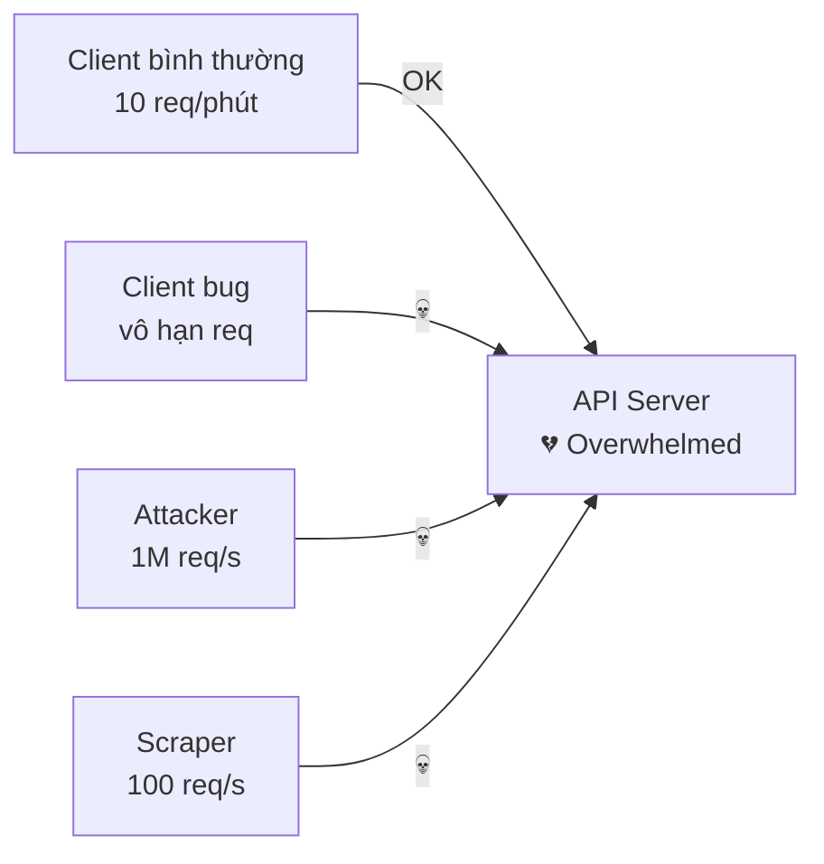

**Không có rate limit:** một client duy nhất có thể làm toàn bộ hệ thống tê liệt — dù vô tình (bug) hay cố ý (attack).

---

### Phân biệt 3 khái niệm hay nhầm

| Khái niệm | Hành vi khi vượt ngưỡng | Dùng ở đâu |
|---|---|---|
| **Rate Limiting** | Reject ngay — trả 429 | HTTP API server |
| **Throttling** | Delay — giữ lại, xử lý sau | Async worker, Kafka consumer |
| **Load Shedding** | Reject có chọn lọc khi system quá tải | Circuit breaker, infrastructure |

> **Lưu ý thực tế:** AWS, Stripe, GitHub đều gọi là "rate limiting" dù thực ra là reject (429). Từ "throttling" bị dùng sai rộng rãi. Trong HTTP context: throttling = rate limiting = 429.

**Throttling thật** chỉ xuất hiện ở async system:

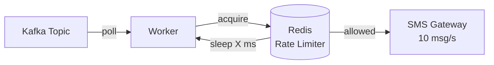

Worker tự kìm tốc độ trước khi đẩy sang downstream — không có client nào chờ HTTP response ở đây.

---

### HTTP Status Codes

```
429 Too Many Requests   ← rate limit (user gửi quá nhiều)
503 Service Unavailable ← load shedding (system đang quá tải)
403 Forbidden           ← authorization (không phải rate limit!)

Kèm headers:
Retry-After: 30              ← chờ bao lâu (giây)
X-RateLimit-Limit: 100       ← limit là bao nhiêu
X-RateLimit-Remaining: 0     ← còn bao nhiêu
X-RateLimit-Reset: 1704067320 ← epoch khi nào reset
```

---

## 2. Implementation Layers

**P2:** Rate limiting không chỉ sống ở một chỗ. Nó có thể — và nên — được áp dụng ở nhiều tầng cùng lúc, mỗi tầng chặn một loại threat khác nhau.

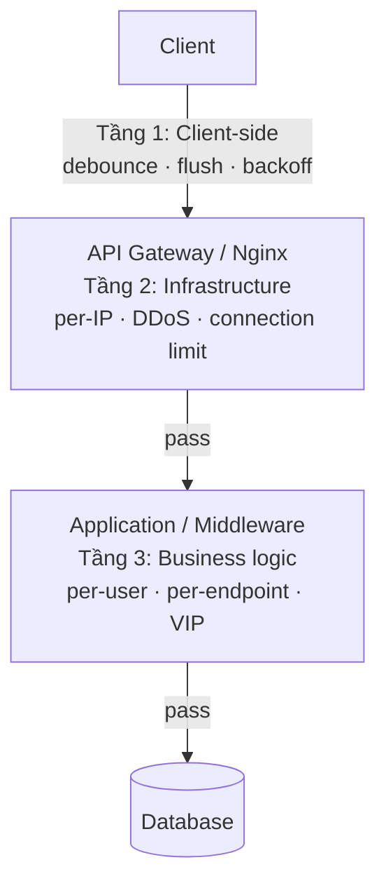

---

### 2.1 Client-side — Ngăn request lãng phí

Không bảo vệ server — mục tiêu là **đừng gửi request thừa ngay từ đầu**.

#### Debounce

```typescript
// Người dùng gõ search → không gọi API mỗi keystroke
const search = debounce((query) => {
    api.search(query)
}, 300)

// Gõ "r","a","t","e" trong 200ms → chỉ gọi 1 lần với "rate"
```

#### Batching / Flush

```typescript
// Thay vì gửi từng analytics event:
track("click", { button: "buy" })   // → 1 request
track("scroll", { depth: 50 })      // → 1 request
track("view", { page: "home" })     // → 1 request

// Batch lại, flush mỗi 2 giây:
const queue = []
setInterval(() => {
    if (queue.length > 0) {
        api.batchTrack(queue)        // → 1 request thay vì N
        queue.length = 0
    }
}, 2000)
```

#### Exponential Backoff với Full Jitter

```typescript
// Khi nhận 429 từ server
async function callWithRetry(fn, maxRetries = 5) {
    for (let i = 0; i < maxRetries; i++) {
        try {
            return await fn()
        } catch (err) {
            if (err.status !== 429) throw err

            // Full jitter: tránh thundering herd
            const cap  = 30_000
            const base = 500
            const wait = Math.random() * Math.min(cap, base * 2 ** i)
            await sleep(wait)
        }
    }
}
```

> **Tại sao full jitter?** 1000 client cùng nhận 429 → cùng retry sau đúng 1s → lại spike. Jitter phân tán retry theo thời gian.

---

### 2.2 Infrastructure — Nginx, API Gateway, Load Balancer

**P1:** Đây là tầng quan trọng nhất về mặt hiệu năng — chặn **trước khi request chạm vào application code**.

#### Nginx — Reverse Proxy + Load Balancer

Nginx không chỉ là web server. Nó là **reverse proxy** đứng trước toàn bộ hệ thống:

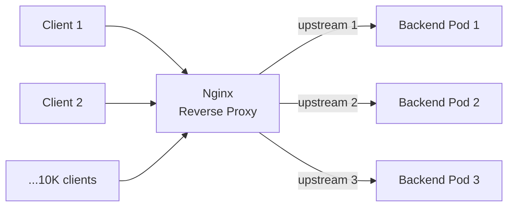

**Tại sao Nginx xử lý được 10,000 connection đồng thời với 1 core?**

Hầu hết web server truyền thống dùng **thread-per-connection** — 10K connection = 10K thread = tốn RAM, context switch chậm.

Nginx dùng **event-driven, non-blocking I/O**:

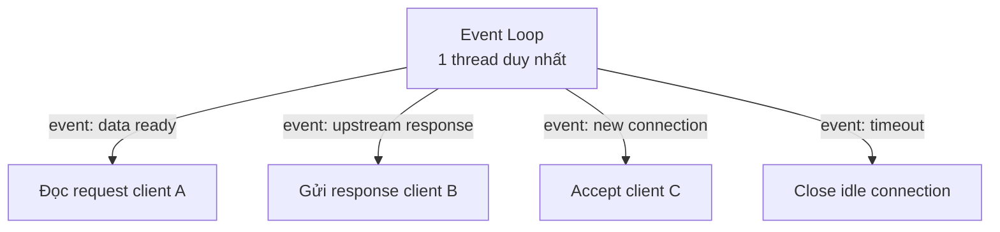

- 1 worker process xử lý hàng nghìn connection **không block**
- Khi chờ network I/O → worker làm việc khác, không ngồi chờ
- Giống Node.js event loop, nhưng ở C và nhanh hơn nhiều

#### Nginx Rate Limiting

```nginx
# Khai báo zone: theo IP, 10MB RAM, 10 req/s
limit_req_zone $binary_remote_addr zone=api:10m rate=10r/s;

server {
    location /api/ {
        limit_req zone=api burst=20 nodelay;
        # burst=20  : hàng đợi tối đa 20 req vượt rate
        # nodelay   : không delay — reject ngay nếu vượt burst
        proxy_pass http://backend;
    }
}
```

Nginx dùng **Leaky Bucket** internally — đó là lý do có `burst` parameter (= queue size).

#### Load Balancing Algorithms

```nginx
upstream backend {
    # Round Robin (default)
    server backend1:8080;
    server backend2:8080;

    # Least Connections — gửi đến pod ít connection nhất
    least_conn;

    # IP Hash — cùng IP → cùng backend (session sticky)
    ip_hash;

    # Weighted
    server backend1:8080 weight=3;  # nhận 3× traffic
    server backend2:8080 weight=1;
}
```

#### Kong / Envoy

```yaml
# Kong plugin — không cần viết code
plugins:
  - name: rate-limiting
    config:
      minute: 1000
      hour: 10000
      policy: redis       # share state giữa Kong nodes
      redis_host: redis
```

Kong và Envoy xử lý rate limiting **tập trung** — mọi service dùng chung config, không cần implement riêng.

---

### 2.3 Application / Middleware — Business Logic

**P2:** Infrastructure rate limit thô — per IP, không biết user là ai. Application layer mới có **context business**:

```kotlin
@Filter("/**")
class RateLimitFilter(
    private val rateLimiter: TokenBucketRateLimiter
) : HttpServerFilter {

    override fun doFilter(
        request: HttpRequest<*>,
        chain: ServerFilterChain
    ): Publisher<MutableHttpResponse<*>> {

        val userId   = request.headers["X-User-Id"]
        val endpoint = request.path
        val tier     = userService.getTier(userId)  // free / pro / enterprise

        // Limit khác nhau theo tier
        val limit = when (tier) {
            "enterprise" -> 10_000
            "pro"        -> 1_000
            else         -> 100      // free
        }

        val result = rateLimiter.check(key = "$userId:$endpoint", limit = limit)

        return if (!result.allowed) {
            Mono.just(
                HttpResponse.status<Any>(HttpStatus.TOO_MANY_REQUESTS)
                    .header("Retry-After", result.retryAfterMs.toString())
                    .header("X-RateLimit-Remaining", "0")
            )
        } else {
            chain.proceed(request)
        }
    }
}
```

**Điều Infrastructure không làm được, Application làm được:**
- User VIP có limit cao hơn
- Endpoint `/export` có limit riêng (chậm, tốn resource)
- Trial account bị giới hạn hơn paid
- Limit theo API key thay vì IP

---

## 3. Distributed State

**P1:** Trước khi xem các thuật toán, cần hiểu **tại sao Redis và tại sao Lua** — vì mọi thuật toán đều xây trên nền này.

### 3.1 Vấn đề: nhiều pod, counter dùng chung

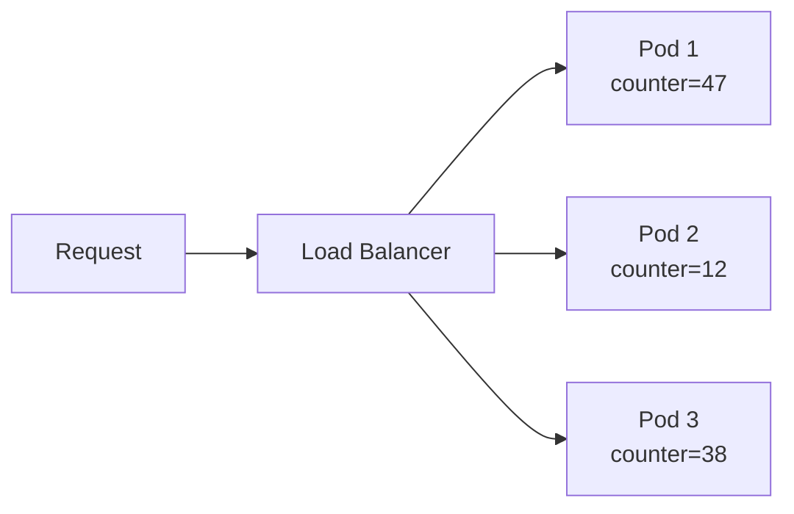

Mỗi pod có counter riêng → tổng thực là 97, nhưng mỗi pod nghĩ mình mới dùng 47/12/38 → limit bị bypass.

**Giải pháp:** Counter dùng chung trên **Redis**.

---

### 3.2 Race Condition — Read-then-Write

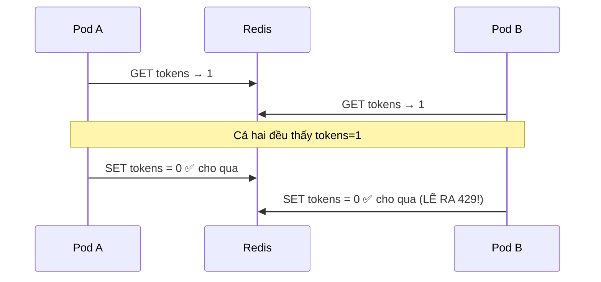

Hai pod đọc cùng lúc → cùng thấy tokens=1 → cả hai ghi đè → **mất 1 lần count**.

---

### 3.3 Giải pháp: Lua Script — Atomic Execution

Redis là **single-threaded**. Lua script chạy là không ai chen vào:

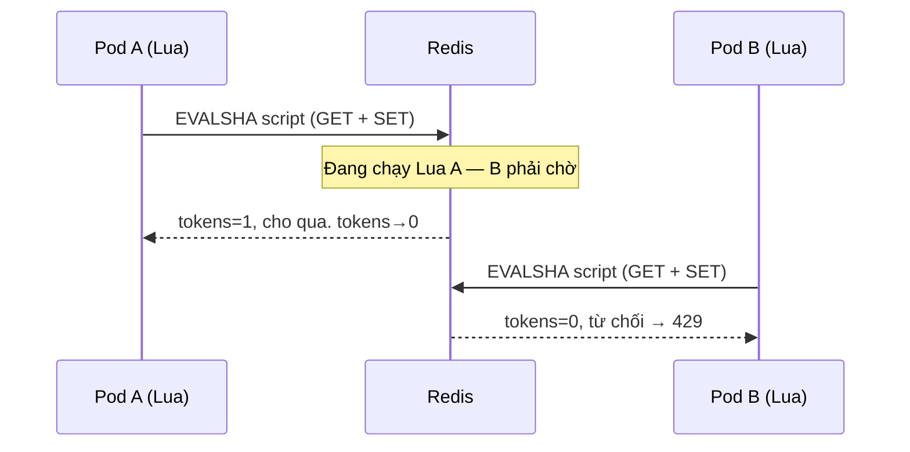

```lua
-- Toàn bộ block này là atomic — không ai chen được
local tokens = tonumber(redis.call('GET', KEYS[1])) or CAPACITY
if tokens >= 1 then
    redis.call('SET', KEYS[1], tokens - 1)
    return 1   -- allowed
else
    return 0   -- rejected
end
```

---

### 3.4 Redis Cluster và Hash Tag

Trong Redis Cluster, Lua script **chỉ chạy được trên 1 node**. Nếu 2 key nằm trên 2 node khác nhau → `CROSSSLOT error`.

**Giải pháp: Hash Tag `{}`**

```bash
# Không có hash tag → 2 key có thể ở 2 node khác nhau
rl:user_456:prev  → node A
rl:user_456:curr  → node B  ← CROSSSLOT!

# Có hash tag → Redis chỉ hash phần trong {}
rl:{user_456}:prev  → hash "user_456" → node B
rl:{user_456}:curr  → hash "user_456" → node B ✅
```

---

### 3.5 Precision vs Performance

| Approach | Latency | Precision | Scale |
|---|---|---|---|
| Lua Script (strong consistency) | 1–4ms (Redis round-trip) | 100% chính xác | ~100k req/s/node |
| Local cache + async sync 100ms | ~0ms (in-memory) | Có thể vượt ~10–30% tạm thời | Triệu req/s |
| Approximate (probabilistic) | 0ms | Thấp | Vô hạn |

**Local cache pattern:**

```
Mỗi pod giữ counter riêng trong memory
Mỗi 100ms → gửi batch update lên Redis

Worst case: 3 pod chưa sync → có thể vượt 3× limit trong 100ms window
→ Chấp nhận được cho feed/social, không chấp nhận cho billing
```

---

## 4. Algorithms

**P2:** Bây giờ mới đến phần thuật toán. Tất cả đều dùng Redis + Lua như đã nói ở trên.

### Bản đồ tổng quan

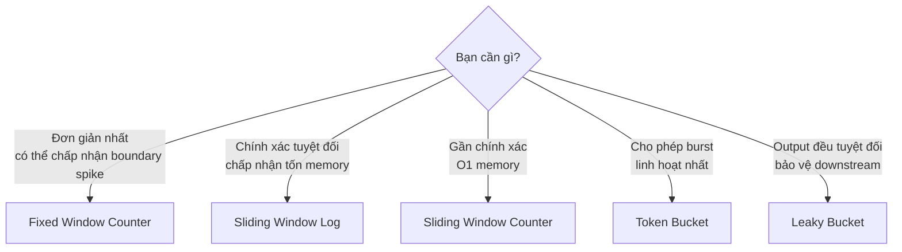

---

### 4.1 Fixed Window Counter

**Cơ chế:** Chia thời gian thành cửa sổ cố định. Mỗi cửa sổ = 1 counter.

```
window_index = floor(now_seconds / 60)
key = "rl:{user_456}:{window_index}"

INCR key   → tăng counter
EXPIRE key 60  → tự xóa sau 60s
```

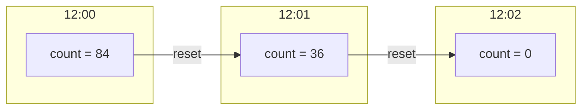

**Điểm mạnh:** Đơn giản nhất, O(1), `INCR` atomic sẵn không cần Lua  
**Điểm yếu:** Boundary spike — 99 req lúc 12:00:59 + 99 req lúc 12:01:01 = 198 req trong 2 giây nhưng đều hợp lệ

```
12:00:59 → 99 request → count_12:00 = 99 < 100 ✅
12:01:01 → 99 request → count_12:01 = 99 < 100 ✅
Thực tế: 198 request trong 2 giây 💀
```

---

### 4.2 Sliding Window Log

**Cơ chế:** Lưu timestamp của từng request trong Redis Sorted Set.

```
ZREMRANGEBYSCORE key -inf (now-60s)  → xóa request cũ
ZCARD key                             → đếm còn lại
ZADD key now now                      → ghi timestamp mới
```

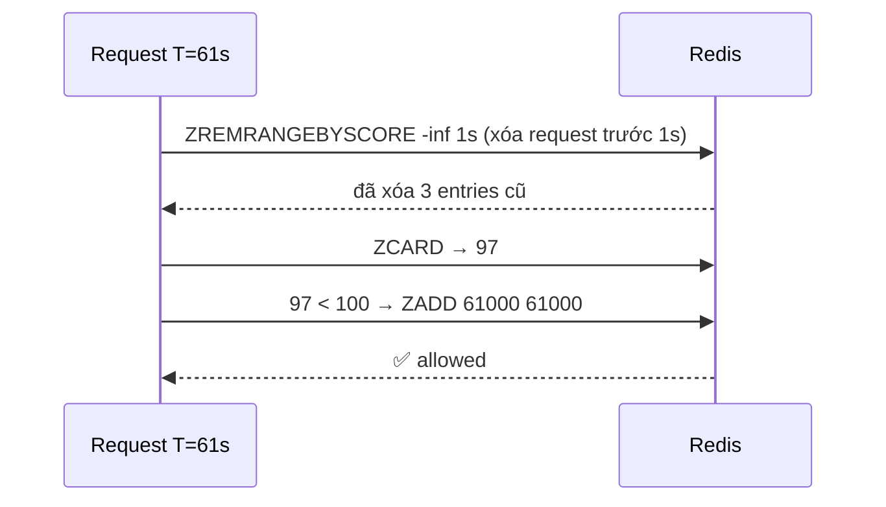

**Điểm mạnh:** Chính xác tuyệt đối, không có boundary spike  
**Điểm yếu:** O(N) memory — 1 user × 100 req/phút = 100 entry trong Redis. 1M user = 100M entry

---

### 4.3 Sliding Window Counter

**Cơ chế:** Hybrid — chỉ lưu 2 counter, ước lượng bằng trọng số.

```
estimate = prev_count × weight + curr_count
weight   = 1 - (elapsed / window_size)
```

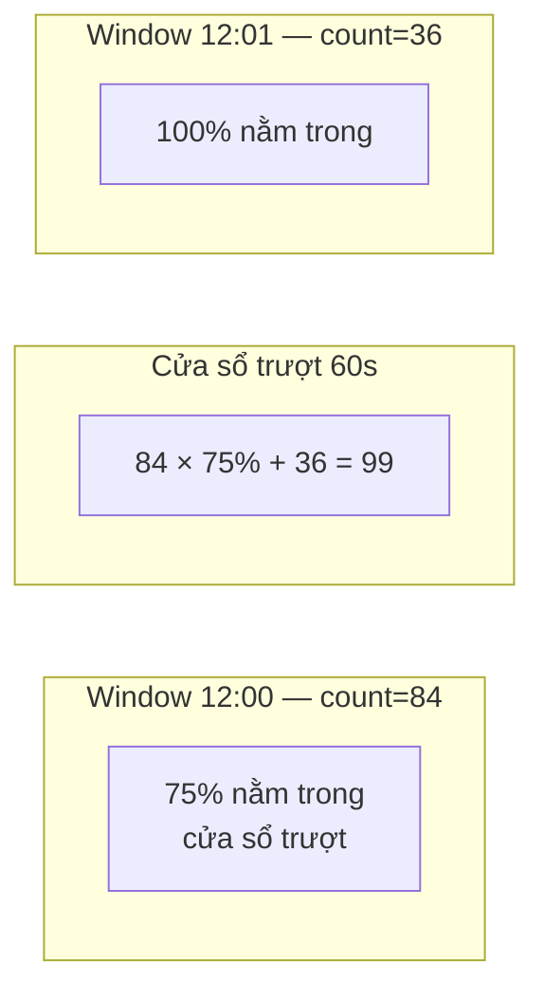

**Điểm mạnh:** O(1) memory, gần chính xác (~0–5% sai số)  
**Điểm yếu:** Giả định phân bố đều → worst case 2× limit khi burst dồn cuối window

```
12:00:59 → 99 request, 12:01:58 → 98 request
estimate = 99 × (1/60) + 98 ≈ 99.65 → cho qua ❌
Thực tế: 197 request trong 60s
```

---

### 4.4 Token Bucket

**Cơ chế:** Bucket chứa token. Token nạp liên tục theo rate. Request tiêu 1 token.

```
State: { tokens, last_ts }

Khi có request:
  elapsed    = now - last_ts
  new_tokens = min(capacity, tokens + elapsed × rate)  ← lazy refill
  if new_tokens >= 1 → cho qua, tokens--
  else               → 429
```

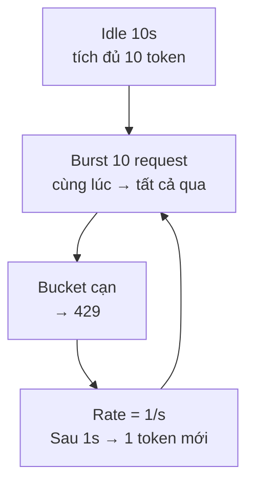

**Điểm mạnh:** Cho phép burst có kiểm soát, O(1), Retry-After chính xác, không boundary spike  
**Điểm yếu:** Cần tune 2 tham số (capacity + rate)

---

### 4.5 Leaky Bucket

**Cơ chế:** Queue với trần. Xả đều đặn ra downstream.

```
State: { queue_size, last_drain }

Khi có request:
  drained   = floor(elapsed × drain_rate)
  new_size  = max(0, queue_size - drained)  ← lazy drain
  if new_size < capacity → nhận vào, queue_size++
  else                   → 429
```

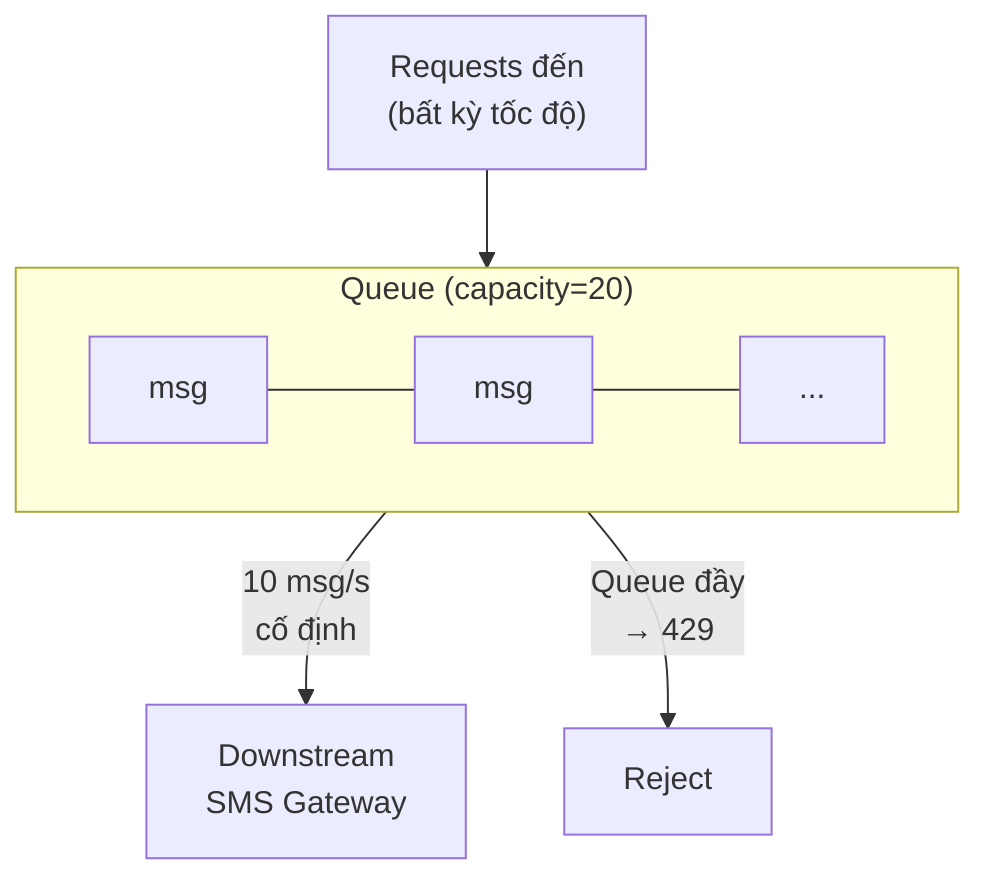

**Điểm mạnh:** Output rate cố định, bảo vệ downstream  
**Điểm yếu:** Counter-based không smooth thật sự (vẫn có thể burst nếu queue chưa đầy). Smooth thật cần FIFO queue (Kafka worker)

---

### So sánh tổng hợp

| Thuật toán | Memory | Boundary Spike | Burst | Retry-After chính xác | Phù hợp |
|---|---|---|---|---|---|
| Fixed Window | O(1) | ❌ 2× | ❌ | ❌ | Đơn giản, ít quan trọng |
| Sliding Log | O(N) | ✅ | ❌ | ❌ | Billing, cần chính xác tuyệt đối |
| Sliding Counter | O(1) | ⚠️ ~2× worst | ❌ | ❌ | Hầu hết API public |
| Token Bucket | O(1) | ✅ | ✅ | ✅ | **Default tốt nhất** |
| Leaky Bucket | O(1) | ✅ | ❌ | ✅ | Bảo vệ downstream |

> **Footnote — GCRA (Generic Cell Rate Algorithm):** Tương đương toán học với Token Bucket nhưng chỉ lưu 1 giá trị `tat` (Theoretical Arrival Time) trong Redis thay vì 2 giá trị `{tokens, ts}`. Dùng trong `redis-cell` module. Không phổ biến trong application code thông thường — Token Bucket đủ dùng và dễ hiểu hơn.

---

## 5. System Design

**P1:** Bây giờ ghép tất cả lại để thiết kế một rate limiter phân tán hoàn chỉnh.

### 5.1 Yêu cầu hệ thống

```
- 10 triệu user
- 100,000 req/s peak
- Limit: 1000 req/phút per user
- Limit: 500,000 req/phút global per endpoint
- Latency overhead < 5ms
- Availability 99.99%
```

### 5.2 Kiến trúc tổng thể

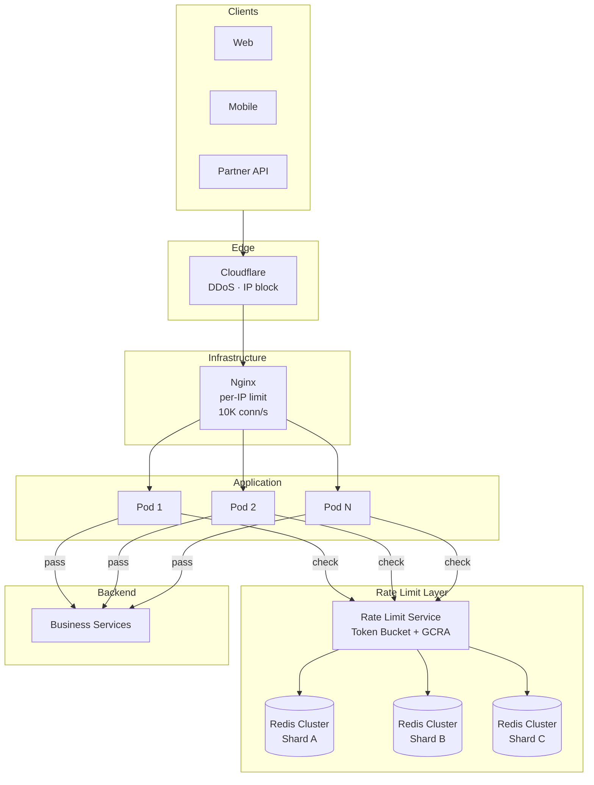

### 5.3 Redis Cluster sharding

```
Per-user key:    rl:{user_456}:token
→ hash "user_456" → 1 slot cố định → 1 node cố định
→ Lua script chạy được, không CROSSSLOT

Global key:      rl:global:{/api/send}:shard:{random(0,15)}
→ 16 shard, mỗi shard = total_limit / 16 × 1.1 (buffer 10%)
→ Phân tán write, không hotspot
```

### 5.4 Hard Limit vs Soft Limit

| | Hard Limit | Soft Limit |
|---|---|---|
| Định nghĩa | Vượt ngưỡng → reject ngay | Vượt ngưỡng → cảnh báo, có thể tiếp tục |
| Hành vi | 429 tức thì | Log + alert, throttle nhẹ, hoặc tính phí thêm |
| Ví dụ | Free tier: 100 req/phút cứng | Pro tier: 1000 req/phút, vượt → charge overage |
| Dùng khi | Bảo mật, prevent abuse | Business flexibility, paid tier |

**Soft limit trong practice:**

```kotlin
val result = rateLimiter.check(userId)

when {
    result.count > hardLimit  -> return 429
    result.count > softLimit  -> {
        logger.warn("User $userId approaching limit: ${result.count}")
        response.header("X-RateLimit-Warning", "approaching limit")
        // vẫn cho qua, nhưng log để billing
        proceed()
    }
    else -> proceed()
}
```

### 5.5 Fail-open vs Fail-closed

**Khi Redis down, làm gì?**

```kotlin
fun check(userId: String): RateLimitResult {
    return try {
        redisCheck(userId)
    } catch (e: RedisException) {
        when (failStrategy) {
            FAIL_OPEN   -> RateLimitResult(allowed = true)  // tiếp tục serve
            FAIL_CLOSED -> RateLimitResult(allowed = false) // chặn tất cả
        }
    }
}
```

| | Fail-open | Fail-closed |
|---|---|---|
| Khi Redis down | Cho tất cả qua | Chặn tất cả |
| Availability | Cao | Thấp |
| Security | Thấp (có thể bị abuse) | Cao |
| Dùng khi | UX quan trọng hơn | Billing/security quan trọng hơn |

**Thực tế:** hầu hết public API dùng fail-open với circuit breaker — tạm thời không giới hạn, nhưng monitor chặt.

---

## 6. Demo

### Tổng quan hệ thống demo

**P2:** Demo này là một ứng dụng chạy thật — không phải slide, không phải mock. Chúng ta sẽ thay đổi thuật toán live và thấy ngay sự khác biệt.

```mermaid
graph LR
    subgraph Frontend
        A[Admin Page\nConfig + State Viewer]
        C[Client Page\ntab user_A / user_B / user_C]
    end

    subgraph Backend ["Backend: Kotlin Micronaut"]
        API[GET /api/hello\nRate limited endpoint]
        CFG[POST /config\nĐổi algo + params]
        RST[POST /config/reset\nClear state]
        SSE[GET /events\nSSE stream]
    end

    subgraph State ["Redis"]
        R[(config key\n+ rl:{user}:* keys)]
    end

    A -->|đổi algo| CFG
    A -->|clear| RST
    C -->|blast requests| API
    A & C -->|subscribe| SSE
    API & CFG & RST --> R
```

**Default params khi chạy demo:**

| Algo | Params |
|---|---|
| Fixed Window | `window=10s`, `limit=5` |
| Sliding Log | `window=10s`, `limit=5` |
| Sliding Counter | `window=10s`, `limit=5` |
| Token Bucket | `capacity=5`, `rate=0.5 token/s` |
| Leaky Bucket | `capacity=10`, `drain_rate=0.5 req/s` |

---

### 6.1 Admin Page

Gồm 3 phần:

#### Phần 1 — Config Panel

```
Algo:   [Token Bucket ▼]

─── Params (thay đổi theo algo) ───
capacity:        [5 ]
rate_per_second: [0.5]

[💾 Save & Apply]   [🗑 Reset State]
```

- **Save & Apply:** `POST /config` → backend clear tất cả `rl:*` key → apply algo mới cho mọi request kế tiếp. Không restart.
- **Reset State:** `POST /config/reset` → chỉ xóa counter, giữ nguyên algo.

#### Phần 2 — State Visualizer (dynamic theo algo)

Hiển thị state Redis thực tế của 3 users, tự refresh qua SSE.

| Algo | Visualizer hiển thị |
|---|---|
| Fixed Window | `COUNT [███░░] 3/5  reset in 7s` per user |
| Token Bucket | `TOKENS [██░░░] 2/5  +0.5/s` per user |
| Sliding Log | `ENTRIES: 4 timestamps in window` per user |
| Sliding Counter | `prev=8 curr=3 weight=75% est=9` per user |
| Leaky Bucket | `QUEUE [████░░░░░░] 4/10` per user |

#### Phần 3 — Live Log

```
12:01:05.123  user_A  200 ✅  tokens_left=4
12:01:05.234  user_B  200 ✅  tokens_left=4
12:01:05.345  user_A  429 ❌  retry_after=4200ms
12:01:05.456  user_A  429 ❌  retry_after=4100ms
```

---

### 6.2 Client Page

Mở nhiều tab — mỗi tab là 1 user. Tab 1 = `user_A`, Tab 2 = `user_B`, Tab 3 = `user_C`.

```
User: [user_A ▼]

[💥 Blast 8 Requests]
[⏱ Demo Boundary Spike]    ← chỉ xuất hiện khi algo = Fixed Window
[⛔ Cancel All]
```

**Blast 8 Requests:** gửi 8 request đồng thời đến `GET /api/hello?user_id=user_A`. Kết quả hiển thị real-time:

```
[12:01:05.123]  → 200 OK  ✅  tokens_left=4
[12:01:05.124]  → 200 OK  ✅  tokens_left=3
[12:01:05.125]  → 200 OK  ✅  tokens_left=2
[12:01:05.126]  → 200 OK  ✅  tokens_left=1
[12:01:05.127]  → 200 OK  ✅  tokens_left=0
[12:01:05.128]  → 429 ❌   Retry-After: 2000ms
[12:01:05.129]  → 429 ❌   Retry-After: 1998ms
[12:01:05.130]  → 429 ❌   Retry-After: 1996ms
```

**Cancel All:** dùng `AbortController` hủy toàn bộ request đang in-flight.

---

### 6.3 Demo Boundary Spike — Fixed Window

Chỉ xuất hiện khi `algo = fixed_window`. Flow tự động:

```
[Click "Demo Boundary Spike"]

Bước 1: Client GET /config → biết window_seconds + window_start_epoch
Bước 2: Tính ms_until_end = window_end - now
Bước 3: Đợi đến khi còn 1.5s

Bước 4: Blast 5 request → log: 5 ✅ (window cũ, count 1→5)
Bước 5: Đợi window reset (1.5s)
Bước 6: Blast 5 request → log: 5 ✅ (window mới, count 1→5)

Bước 7: Toast ⚠️ "10 requests trong 3 giây — 2× limit!"
```

**Ý nghĩa:** Với `limit=5, window=10s`, người xem thấy trực tiếp 10 request đi qua trong 3 giây — minh họa boundary spike mà không cần giải thích bằng lời.

---

### 6.4 Kịch bản thuyết trình

**Bước 1 — Fixed Window, quan sát boundary spike**
1. Admin set algo = Fixed Window, limit=5, window=10s
2. Client Tab 1 click **"Demo Boundary Spike"**
3. Thấy: 10 request xanh liên tiếp trong 3 giây → "đây là vấn đề Fixed Window"

**Bước 2 — Token Bucket, quan sát burst**
1. Admin đổi sang Token Bucket, capacity=5, rate=0.5/s
2. Client Tab 1 click **Blast 8**
3. Thấy: 5 xanh → 3 đỏ. State Visualizer: bucket = 0/5
4. Chờ 2s → bucket nạp 1 token → blast 1 → xanh
5. "Burst được phép, sau đó steady rate"

**Bước 3 — Multi-user, per-user isolation**
1. Giữ Token Bucket
2. Tab 1 (user_A) đã dùng hết token
3. Tab 2 (user_B) click Blast 8 → 5 xanh
4. "Mỗi user có bucket riêng — user_A bị chặn không ảnh hưởng user_B"

**Bước 4 — Leaky Bucket, output đều**
1. Admin đổi sang Leaky Bucket, capacity=10, drain_rate=0.5/s
2. Tất cả 3 user cùng blast → xem queue fill dần
3. Reset State → burst lại → quan sát drain đều đặn

---

### 6.5 SSE Event Format

Cả Admin và Client đều subscribe `GET /events` — cùng xem log của tất cả users.

```json
{
  "ts": "12:01:05.123",
  "user_id": "user_A",
  "algo": "token_bucket",
  "status": 200,
  "retry_after_ms": null,
  "state_snapshot": {
    "tokens": 4,
    "capacity": 5
  }
}
```

```json
{
  "ts": "12:01:05.456",
  "user_id": "user_A",
  "algo": "token_bucket",
  "status": 429,
  "retry_after_ms": 4200,
  "state_snapshot": {
    "tokens": 0,
    "capacity": 5
  }
}
```

---

## 7. Checkpoint Questions

### Easy
**Q: HTTP status code nào trả về khi vượt rate limit?**

> **A:** `429 Too Many Requests`. Kèm header `Retry-After` để client biết chờ bao lâu.

---

### Medium
**Q: Tại sao Fixed Window cho phép 2× traffic tại biên?**

> **A:** Vì mỗi window reset độc lập. Tại `12:00:59`, user gửi 100 request → window 12:00 cho phép (count=100). Sang `12:01:00` ngay sau đó, counter reset = 0 → 100 request nữa cũng được phép. Tổng: **200 request trong 2 giây**, dù limit là 100/phút. Sliding Window fix được bằng cách cửa sổ trượt liên tục thay vì reset đột ngột.

---

### Hard
**Q: Redis latency 5ms mỗi round-trip → ảnh hưởng throughput thế nào? Optimize bằng cách nào?**

> **A:**
>
> **Impact:**
> - Mỗi request phải thêm 5ms để check rate limit
> - Throughput tối đa per thread = 1000ms / 5ms = **200 req/s per thread**
> - Với 100 coroutine: 100 × 200 = 20,000 req/s — không phải vô hạn
>
> **Optimizations:**
>
> 1. **EVALSHA thay vì EVAL** — script đã được load sẵn, gửi SHA hash (~40 bytes) thay vì full script → giảm payload
>
> 2. **Connection pool** — tái sử dụng connection thay vì tạo mới mỗi request
>
> 3. **Local cache + async sync** — check in-memory trước (0ms), batch update Redis mỗi 100ms → giảm 99% round-trips. Trade-off: có thể vượt limit ~10% trong 100ms window
>
> 4. **Redis Cluster gần hơn** — deploy Redis cùng AZ với application, latency từ 5ms xuống 0.5ms
>
> 5. **Pipeline** — gộp nhiều lệnh Redis vào 1 round-trip (chỉ áp dụng được với non-Lua operations)

---

## Phụ lục: Key Concepts

| Khái niệm | Một dòng |
|---|---|
| Rate Limiting | Reject khi vượt ngưỡng (429) |
| Throttling | Delay khi vượt ngưỡng — chỉ tồn tại trong async system |
| Bucket | Vật chứa có giới hạn, thay đổi theo thời gian |
| Fixed Window | Reset theo đồng hồ, đơn giản, có boundary spike |
| Sliding Window | Cửa sổ trượt, chính xác hơn, tốn hơn |
| Token Bucket | Tích token khi idle, tiêu khi dùng — cho phép burst |
| Leaky Bucket | Queue với trần — output rate cố định |
| GCRA | Token Bucket toán học tương đương, lưu 1 giá trị `tat` — dùng trong redis-cell |
| Distributed Counting | Redis + Lua = atomic counter chia sẻ giữa nhiều pod |
| Hash Tag `{}` | Đảm bảo các key liên quan vào cùng 1 Redis node |
| Backpressure | Downstream báo upstream chậm lại (429 + Retry-After) |
| Fail-open | Redis down → cho qua (UX trên security) |
| Fail-closed | Redis down → chặn tất cả (security trên UX) |
| Hard Limit | Vượt → reject ngay |
| Soft Limit | Vượt → cảnh báo, charge thêm, hoặc throttle nhẹ |
| DoS Protection | Rate limit là lớp cuối — CDN/Shield mới là lớp đầu |
